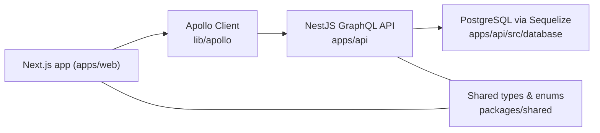

# ShiftSync – Evaluator Guide

This document is the **primary handoff** for running and reviewing the submission: local setup, test accounts, what to click, known gaps vs the brief, and a short proof checklist.

## How to run locally

- **Prerequisites**
  - **Node.js 22+** (required; repo `engines` enforces this)
  - Yarn 1.x
  - Docker + Docker Compose

- **1. Start PostgreSQL**

```bash
docker compose -f docker-compose.local.yml up -d
```

The local database is available at:

- Host: `localhost:5440`
- Database: `shiftsync`
- User: `shiftsync`
- Password: `shiftsync`

- **2. Environment**

From the repo root:

```bash
cp .env.example .env
```

Also copy this env file for API CLI commands (migrate/seed/e2e):

```bash
cp .env apps/api/.env
```

Key variables:

- `DATABASE_URL`: PostgreSQL connection string (local Docker by default).
- `JWT_SECRET`: Secret used to sign access tokens (change in any non-local environment).
- `PORT`: API HTTP + WebSocket port (defaults to `3001`).
- `API_URL`: Base URL the frontend uses in local development.
- `WS_URL`: WebSocket URL the frontend uses in local development.

- **3. Install dependencies**

```bash
yarn install
```

- **4. Run the applications**

```bash
# Backend (NestJS API + Socket.io)
yarn api:dev

# Frontend (Next.js)
yarn web:dev
```

- API: `http://localhost:3001` (GraphQL endpoint at `/graphql`, Socket.io at `/socket.io`)
- Web: `http://localhost:3000`

## How to log in / test accounts

The system is seeded with several test users when you run migrations + seeds:

```bash
cd apps/api
yarn migrate
yarn seed
```

Example roles (exact emails/passwords are documented in `docs/SEED_AND_SCENARIOS.md`):

- **Admin** – full system administration: locations, skills, constraints.
- **Manager** – manages schedules and approvals for one or more locations.
- **Staff** – can view their own shifts, request changes, drop/swap, and see fairness information.

When evaluating, please refer to `docs/SEED_AND_SCENARIOS.md` for:

- Concrete accounts (email/password per role).
- Example scheduling scenarios.
- Suggested flows to exercise: approvals, swap/drop, overtime, and fairness screens.

## Known limitations (submission honesty)

- **Scope**: Built for the assessment brief, not a full enterprise product (no SSO/password reset, simplified auth).
- **Notifications**: In-app notification center + Socket.io `notification` events are implemented. **Per-user channel toggles** exist in the API (`notification_preferences`) but there is **no settings screen** in the web app yet; **email simulation** (logging or stub send) is **not** wired when creating notifications.
- **Manager alerts**: Swap/drop and schedule events notify managers/staff in the implemented flows; **proactive** pushes for every overtime threshold or every staff availability edit are **not** guaranteed end-to-end—rely on dashboards and assignment-time warnings where documented.
- **Concurrency demo**: E2E proves **same user / same shift** duplicate assignment rejection under concurrent GraphQL calls (locks + explicit duplicate row check). Cross-location “same wall time, different zones” may not overlap in UTC; see verification table below.
- **Fairness / reports**: Metrics reflect **current** DB state and seeded templates; deep historical analytics are out of scope.
- **Timezones**: **Location** IANA zone drives server interval math and **calendar** display (`apps/web/lib/calendar-location-time.ts`). **Per-user** timezone preference for all screens and exhaustive **DST** regression suites are deferred (`docs/ASSUMPTIONS_AND_DECISIONS.md`).
- **UX**: Some flows use minimal confirmations and short error copy for speed of demo.

## Location management & roles

- **Admins**
  - Can create, edit, and delete locations (name + timezone).
  - Control which managers run which locations via manager–location assignments.
  - Control which staff are certified for which locations via staff–location assignments.
  - See all locations everywhere in the app.
- **Managers**
  - Can view only the locations they are assigned to.
  - Can schedule shifts, approve requests, and view reports only for their locations.
- **Staff**
  - Can view only locations where they are certified to work (drives which shifts they can be assigned to).

All changes to locations and assignments flow through the GraphQL API and participate in the existing audit and constraint logic.

## Deployment overview

- **Backend (API + WebSocket)**: Deployed to Railway as a Node service.
  - Build command: `yarn api:build`
  - Start command: `yarn api:start`
  - Required env:
    - `DATABASE_URL` – Railway PostgreSQL connection string or external Postgres URL.
    - `JWT_SECRET` – production-strength secret.
    - `PORT` – service port (Railway will inject; app defaults to `3001`).
    - `CORS_ORIGIN` – comma-separated list of allowed origins (e.g. `https://shiftsync.vercel.app`).

- **Frontend (Next.js)**: Deployed to Vercel.
  - Build command: `yarn workspace web build`
  - Required env:
    - `NEXT_PUBLIC_GRAPHQL_URL` – e.g. `https://<railway-api>.up.railway.app/graphql`
    - `NEXT_PUBLIC_WS_URL` – e.g. `wss://<railway-api>.up.railway.app`

For full details on deployment decisions and assumptions, see `docs/ASSUMPTIONS_AND_DECISIONS.md`.

## Architecture at a glance

The system is split into three main pieces:

- `apps/api` — NestJS GraphQL API + Socket.io, using Sequelize and PostgreSQL.
- `packages/shared` — shared enums and domain types (`*Attributes`, `*Db`) reused by both the API and DB models.
- `apps/web` — Next.js App Router frontend using Apollo Client and the shared types.



## Architecture and tradeoffs

- **Template-based shifts**: shifts store a date range + daily times; runtime logic expands to concrete daily intervals for constraints, overtime, and reports.
- **Skill + headcount**: each **shift** stores `requiredSkillId` and `headcountNeeded`. New assignments must use that skill by default, and count is capped at `headcountNeeded`; duplicate **(shift, user)** rows are rejected. This matches the brief while still storing `skillId` on each assignment for a clear audit trail.
- **Scoped manager access**: managers are restricted to assigned locations across scheduling, approvals, and reports; admins remain global.
- **Concurrency handling**: assignment and request flows use server-side constraints and conflict responses; concurrent assignment conflicts are surfaced via API and real-time events.
- **Real-time boundary**: Socket.io is used for schedule/request update events to keep dashboards and staff views synchronized without manual refresh.
- **Timezone handling**: server-side logic respects each **location’s** timezone for derived intervals; calendar shift times are rendered in each shift’s location timezone.

## Verification evidence (assessment)

| Requirement area | How it’s demonstrated |
|------------------|------------------------|
| **Real-time updates** | Open **On-duty** (manager/admin): schedule changes trigger Socket.io events (`schedule_updated`, `swap_resolved`, etc.) and the page refetches. Similar patterns exist for other dashboards wired to the socket hook. |
| **Concurrent assignment / conflicts** | Duplicate assignment to the same shift for the same user is rejected (`Staff is already assigned to this shift.`); racing `addAssignment` calls are serialized via DB locks. Overlapping *different* shifts still use interval double-book rules where DATEONLY expansion is consistent. E2E: `apps/api/test/shifts.e2e-spec.ts` (`same staff cannot be assigned twice…`, `concurrent duplicate addAssignment…`). `assignment_conflict` may fire on constraint failure. |
| **Swap/drop workflow & races** | Accept uses conditional DB updates; duplicate accept surfaces as conflict. E2E: `apps/api/test/requests.e2e-spec.ts` (`drop: availableDrops respects manager read scope; second acceptDrop fails…`). |
| **Scoped access (marketplace, on-duty)** | `availableDrops` / `availableSwaps` and `onDutyShifts` filter by role + allowed locations. E2E: same `requests.e2e-spec` + `shifts.e2e-spec` (`onDutyShifts for manager2…`). |
| **Frontend privilege** | Approvals, audit, fairness, overtime, on-duty pages **skip** privileged GraphQL until role is allowed; shift **Add assignment** is manager/admin only. |

**Commands (after DB is up, migrate + seed):**

```bash
yarn lint
yarn api:build
yarn web:build
cd apps/api && yarn test:e2e
yarn web:test
```

## Evaluator proof checklist (step-by-step)

After `migrate` + `seed` (or your test DB), use these flows for a fast audit.

### 1) Audit trail for publish / unpublish / publish week

- Log in as a **manager** (see `docs/SEED_AND_SCENARIOS.md`).
- **Publish** a draft shift (`publishShift`), **publish a week** (`publishWeek`), or **unpublish** before cutoff.
- As **admin** (or role allowed for audit), run GraphQL **`shiftHistory(shiftId: "...")`** or **`auditExport`** for a time range and optional `locationId`.
- Expect **`AuditEntryEntity`** rows with `entityType` for shifts, `action` matching updates, and non-null **`before` / `after`** JSON reflecting `published` and related shift fields.

### 2) Calendar timezone (location-local wall time)

- Run: `cd apps/web && CI=true yarn test -- --no-watchman` (or `yarn web:test` from repo root) so `apps/web/lib/__tests__/calendar-location-time.test.ts` executes.
- Manually: open **Calendar**, pick a location with a non-UTC zone, and confirm slot labels match **that location’s** local `dailyStartTime` / `dailyEndTime`, not the browser’s default zone.

### 3) Real-time + notifications (swap/drop manager steps, staff publish)

- With API and web running, open two browsers: **manager** (approvals / schedule) and **staff** (schedule / notifications).
- Complete a swap or drop through **manager approve / reject / cancel**; listen for Socket.io events such as `schedule_updated`, `swap_resolved`, and `drop_resolved` (see `WS_EVENTS` in `apps/api/src/events/events.gateway.ts`).
- Expect **persisted notifications** for the involved staff (and correct event type for drops vs swaps on cancel).
- **Publish** or **edit a published** shift with assignments: assigned **staff** should get persisted notifications (`schedule_published_staff`, updated copy on edit), not only managers.

### 4) Concurrency / assignment serialization

- Automated: `cd apps/api && CI=true yarn test:e2e` — see **`concurrent duplicate addAssignment same shift same user`** in `apps/api/test/shifts.e2e-spec.ts` (exactly one GraphQL mutation succeeds; the other returns a constraint error mentioning **already assigned**).

---

## What’s in this submission

- **Source**: `apps/api`, `apps/web`, `packages/shared`, migrations, seeds, and tests.
- **Docs**: this file, `docs/ASSUMPTIONS_AND_DECISIONS.md`, `docs/SEED_AND_SCENARIOS.md`, plus optional contributor notes (`docs/REPOSITORY_PATTERN.md`, `docs/THEMING.md`). Root `README.md` is the quick start.
- **Not in repo**: the original assessment PDF/text (keep separately if needed). Cursor IDE plan files under `.cursor/plans/` are gitignored—omit `.cursor/` from any manual zip.
